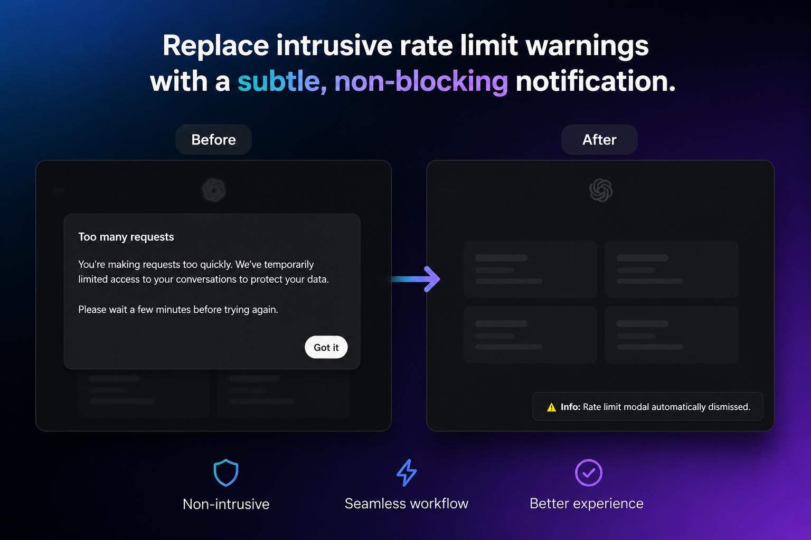

# ChatGPT Scripts

A small collection of Tampermonkey userscripts for ChatGPT.

These scripts are focused on reducing friction, improving workflow, and making common actions faster without changing the core ChatGPT experience.

## Quick install

[Install Auto Dismiss Rate Limit](https://raw.githubusercontent.com/ddpd/chatgpt-scripts/main/scripts/auto-dismiss-rate-limit/chatgpt-auto-dismiss-rate-limit.user.js)

[Install Open Exact Chat](https://raw.githubusercontent.com/ddpd/chatgpt-scripts/main/scripts/open-exact-chat/chatgpt-images-open-exact-chat.user.js)

## Scripts

### ChatGPT - Auto Dismiss Rate Limit

[Install Auto Dismiss Rate Limit](https://raw.githubusercontent.com/ddpd/chatgpt-scripts/main/scripts/auto-dismiss-rate-limit/chatgpt-auto-dismiss-rate-limit.user.js)

Automatically dismisses the rate limit modal and replaces it with a subtle, non-blocking toast notification.

What it does:
- Detects the modal using structure, not text.
- Clicks the primary confirmation button automatically.
- Shows a small non-blocking notification instead of leaving a modal on screen.
- Works on `chatgpt.com` only.
- Uses no special Tampermonkey permissions.

Best for:
- Faster continuation after a temporary rate limit.
- A cleaner ChatGPT workflow.
- Less interruption during frequent use.

### ChatGPT Images - Open Exact Chat

[Install Open Exact Chat](https://raw.githubusercontent.com/ddpd/chatgpt-scripts/main/scripts/open-exact-chat/chatgpt-images-open-exact-chat.user.js)

Opens the exact source chat from image-related UI with a middle click or Ctrl/Cmd + left click.

What it does:
- Detects image cards and related UI elements.
- Opens the exact source conversation in a new tab.
- Preserves the current page so you can keep browsing.
- Works on the `/images` route.
- Uses a SPA-friendly approach.
- Tries multiple structural methods to find the exact chat URL.

Best for:
- Faster navigation from images to the original conversation.
- Fewer clicks.
- Keeping the browsing flow smooth.

## Installation

1. Install Tampermonkey.
2. Open the raw `.user.js` file from this repository, or use one of the install links above.
3. Tampermonkey will detect the script automatically.
4. Install it.

You can also paste the contents manually into a new Tampermonkey script.

## Auto-update

Each script is prepared for GitHub-hosted updates.

After publishing:
- bump `@version`,
- commit the updated `.user.js` file,
- Tampermonkey can update from the raw GitHub URL.
